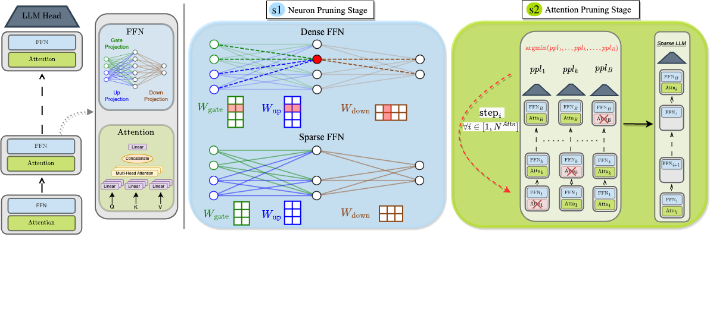

<div align="center">

  ## 2SSP: A Two-Stage Framework for Structured Pruning of LLMs <br> (TMLR 2025)

[Fabrizio Sandri*](https://fabriziosandri.github.io/), [Elia Cunegatti*](https://eliacunegatti.github.io/), [Giovanni Iacca](https://sites.google.com/site/giovanniiacca/) <br>
<sub>* Equal contribution</sub>


**Published in Transaction of Machine Learning Research (TMLR)** <br>
& <br>
*Accepted at Workshop Sparsity in LLMs (SLLM) @ ICLR 2025*

  [](https://arxiv.org/abs/2501.17771) [](https://openreview.net/forum?id=Qd7LzJBg21)
 [](https://openreview.net/pdf?id=j0NRBl9vVd)
</div>


<p align="center">
  
  <br>
  <em></em>
</p>

> **Abstract.**
*We propose a novel Two-Stage framework for Structured Pruning (2SSP) for pruning Large Language Models (LLMs), which combines two different strategies of pruning, namely Width and Depth Pruning. The first stage (Width Pruning) removes entire neurons, hence their corresponding rows and columns, aiming to preserve the connectivity among the pruned structures in the intermediate state of the Feed-Forward Networks in each Transformer block. This is done based on an importance score measuring the impact of each neuron over the output magnitude. The second stage (Depth Pruning), instead, removes entire Attention submodules. This is done by applying an iterative process that removes the Attention submodules with the minimum impact on a given metric of interest (in our case, perplexity). We also propose a novel mechanism to balance the sparsity rate of the two stages w.r.t. to the desired global sparsity. We test 2SSP on four LLM families and three sparsity rates (25%, 37.5%, and 50%), measuring the resulting perplexity over three language modeling datasets as well as the performance over six downstream tasks. Our method consistently outperforms five state-of-the-art competitors over three language modeling and six downstream tasks, with an up to two-order-of-magnitude gain in terms of pruning time.*


## Installation

We recommend setting up the environment using either a Conda environment or a Python virtual environment. Our experiments were conducted using Python 3.11.7.

Clone the `2SSP` repository and install its dependencies:
```bash
git clone https://github.com/FabrizioSandri/2SSP.git
cd 2SSP
pip install -r requirements.txt
```

Install Language Model Evaluation Harness (required for downstream task evaluation):
```bash
cd lm_harness
pip install -e ./
```

## Usage

```
usage: main.py [-h] --model MODEL [--seed SEED] [--cache_dir CACHE_DIR] [--dense]
               [--pruning_method {2ssp,window_based,shortgpt,blockpruner,evopress,slicegpt}]
               [--sparsity_rate SPARSITY_RATE] [--main_table_results] [--evaluate_inference] [--evaluate_downstream]
               [--evaluate_perplexity] [--evaluate_qualitative] [--local_datasets] [--ablation]
               [--logging {DEBUG,INFO,WARNING,ERROR,CRITICAL}]

Pruning of transformer models

options:
  -h, --help            show this help message and exit
  --model MODEL         Specify the model's name or path to be pruned
  --seed SEED           Set a seed for reproducibility (default: 0)
  --cache_dir CACHE_DIR
                        Path to a directory in which a downloaded pretrained model should be cached. This option is not
                        supported when --pruning_method=slicegpt
  --dense               Load the original dense model without pruning
  --pruning_method {2ssp,window_based,shortgpt,blockpruner,evopress,slicegpt}
                        Specify the pruning method to apply
  --sparsity_rate SPARSITY_RATE
                        A floating-point value ranging from 0.0 to 1.0 that determines the target sparsity level for
                        pruning. If set to -1, pruning is performed at all sparsity levels from 0.0 to 1.0 with a step size
                        of 1/N. A value of -2 applies pruning at predefined sparsity levels of 25%, 37.5%, and 50%.)
  --main_table_results  Generate results for the main results table in the paper (Table 1)
  --evaluate_inference  Measure the model's inference time
  --evaluate_downstream
                        Perform downstream task evaluation at 37.5% sparsity
  --evaluate_perplexity
                        Evaluates perplexity on Wikitext2 only
  --evaluate_qualitative
                        Qualitative results
  --local_datasets      Use local datasets stored in the './data/' folder
  --ablation            Run the ablation study experiments
  --logging {DEBUG,INFO,WARNING,ERROR,CRITICAL}
                        Set the logging level (default: INFO)
```

#### Examples
- Dense Model Perplexity Evaluation:
   ```bash
   python 2ssp/main.py --model=meta-llama/Llama-2-7b-hf --dense --evaluate_perplexity
   ```

- Pruning at 50% sparsity with `2ssp` and evaluating perplexity:
   ```bash
   python 2ssp/main.py --model=meta-llama/Llama-2-7b-hf --pruning_method=2ssp --sparsity_rate=0.5 --evaluate_perplexity
   ```
- Pruning at 50% sparsity with `ShortGPT` and evaluating perplexity:
   ```bash
   python 2ssp/main.py --model=meta-llama/Llama-2-7b-hf --pruning_method=shortgpt --sparsity_rate=0.5 --evaluate_perplexity
   ```

- Generate main table results for 2SSP at 25%, 37.5% and 50% sparsity on Mistral:
   ```bash
   python 2ssp/main.py --model=meta-llama/Llama-2-7b-hf --pruning_method=2ssp --sparsity_rate=-2 --main_table_results
   ```

- Evaluate downstream tasks at 37.5% sparsity:
   ```bash
   python 2ssp/main.py --model=meta-llama/Llama-2-7b-hf --pruning_method=2ssp --sparsity_rate=0.375 --evaluate_downstream
   ```

## Supported Pruning Methods

- ShortGPT: [https://arxiv.org/abs/2403.03853](https://arxiv.org/abs/2403.03853)
- Window-Based: [https://arxiv.org/abs/2403.17887](https://arxiv.org/abs/2403.17887)
- SliceGPT: [https://arxiv.org/abs/2401.15024](https://arxiv.org/abs/2401.15024)
- BlockPruner: [https://arxiv.org/abs/2406.10594](https://arxiv.org/abs/2406.10594)
- EvoPress: [https://arxiv.org/abs/2410.14649](https://arxiv.org/abs/2410.14649)

---

## Acknowledgments

Our method includes code sourced from the following repositories:
- [Language Model Evaluation Harness](https://github.com/EleutherAI/lm-evaluation-harness)
- [EvoPress](https://github.com/IST-DASLab/EvoPress)
- [Transformer Compression with SliceGPT](https://github.com/microsoft/TransformerCompression/)

For more details, refer to the documentation or the associated research paper.


## Citation
If you find this work useful, please consider citing:
```bibtex
@article{
sandri2025ssp,
title={2{SSP}: A Two-Stage Framework for Structured Pruning of {LLM}s},
author={Fabrizio Sandri and Elia Cunegatti and Giovanni Iacca},
journal={Transactions on Machine Learning Research},
issn={2835-8856},
year={2025},
url={https://openreview.net/forum?id=Qd7LzJBg21},
note={}
}
```
